#  **FIFA World Cup - Complete Historical Analysis**

> **Every tournament · Every match · Every record · 1930 → 2022 · Looking ahead to 2026**

This project performs a comprehensive data analysis of the FIFA World Cup using five
historical datasets. It covers 22 tournaments (1930–2022) and 852 individual match
records to surface long-term trends in goals, champions, attendance, discipline,
player performance, and host-nation spending -all visualised through a consistent
dark-themed chart suite.

---

##  **Table of Contents**

1. [Project Structure](#-project-structure)
2. [Datasets](#-datasets)
3. [Setup & Requirements](#-setup--requirements)
4. [How to Run](#-how-to-run)
5. [Analysis & Visualisations](#-analysis--visualisations)
   - [All-Time Champions](#1-all-time-champions)
   - [Goals Over Time](#2-goals-over-time)
   - [Match Outcomes](#3-match-outcomes)
   - [First vs Second Half Scoring](#4-first-vs-second-half-scoring)
   - [Team Win Rates & Appearances](#5-team-win-rates--appearances)
   - [Goals by Stage](#6-goals-by-stage)
   - [Biggest Victories & Highest-Scoring Matches](#7-biggest-victories--highest-scoring-matches)
   - [Attendance](#8-attendance)
   - [Top Scorers](#9-top-scorers-2002-2022)
   - [Top Assists](#10-top-assists-2002-2022)
   - [Discipline (Cards)](#11-discipline-cards-2002-2022)
   - [Host Nation Budgets](#12-host-nation-budgets)
   - [Master Dashboard](#13-master-dashboard)
6. [Key Findings](#-key-findings)
7. [Limitations](#-limitations)
8. [Looking Ahead - 2026](#-looking-ahead--2026-world-cup)
9. [Tech Stack](#-tech-stack)

---

##  **Project Structure**

```
worldcup-analysis/
│
├── data/
│   ├── FIFA_history.xlsx          # Tournament-level data (22 WCs, 1930–2022)
│   ├── WorldCupMatches.csv        # Match-level records (852 games, 1930–2014)
│   ├── FIFA_top_goals.csv         # Top 10 scorers per WC (2002–2022)
│   ├── FIFA_top_assists.csv       # Top 10 assisters per WC (2002–2022)
│   └── FIFA_score_table.csv       # Cards per team per WC (2002–2022)
│
├── images/                        # All chart outputs (generated by notebook)
│   ├── champions.png
│   ├── goals_overview.png
│   ├── match_outcomes.png
│   ├── halftime_scoring.png
│   ├── team_records.png
│   ├── goals_by_stage.png
│   ├── biggest_wins.png
│   ├── attendance.png
│   ├── top_scorers.png
│   ├── country_goals.png
│   ├── top_assists.png
│   ├── country_assists.png
│   ├── discipline.png
│   ├── budget.png
│   └── dashboard.png
│
├── notebooks/
│   └── Main-Code-Copy1.ipynb      # Primary analysis notebook (run this)
│
└── requirements.txt
```

---

##  **Datasets**

| File | Rows | Year Range | Key Columns |
|------|------|------------|-------------|
| `FIFA_history.xlsx` | 22 | 1930 – 2022 | Year, Champion, Goals_Scored, Total_Attendance, Budget_B |
| `WorldCupMatches.csv` | 4,572 (852 valid) | 1930 – 2014 | Stage, Home/Away Goals, Half-time Goals, Attendance |
| `FIFA_top_goals.csv` | 300 | 2002 – 2022 | Player, Country, Goals, Games_Played |
| `FIFA_top_assists.csv` | 300 | 2002 – 2022 | Player, Country, Assists, Games_Played |
| `FIFA_score_table.csv` | 191 | 2002 – 2022 | Country, Yellow_Cards, Red_Cards, Points |

All datasets were sourced from [Kaggle — Fifa Worldcup Match Insights (1930 to 2014)](https://www.kaggle.com/datasets/saadaliyaseen/fifa-world-cup-match-insights), and


> **Note:** `WorldCupMatches.csv` contains 4,572 rows but only 852 are populated -the
> rest are blank padding rows and are dropped during loading with `dropna(subset=['Year'])`.

---

##  **Setup & Requirements**

**Python version:** 3.8 or higher

Install all dependencies with:

```bash
pip install -r requirements.txt
```

**`requirements.txt`**

```
pandas>=1.5.0
numpy>=1.23.0
matplotlib>=3.6.0
openpyxl>=3.0.10
nbformat>=5.7.0
jupyter>=1.0.0
```

---

##  **How to Run**

1. Clone or unzip the project folder.
2. Install requirements (see above).
3. Open the notebook:

```bash
cd worldcup-analysis
jupyter notebook notebooks/Main.ipynb
```

4. Run all cells from top to bottom (**Kernel → Restart & Run All**).
5. All charts are saved automatically to the `images/` folder as `.png` files.

> Make sure you run from inside the `worldcup-analysis/` directory so that the
> relative paths `data/` and `images/` resolve correctly.

---

##  **Analysis & Visualisations**

---

### **1. All-Time Champions**

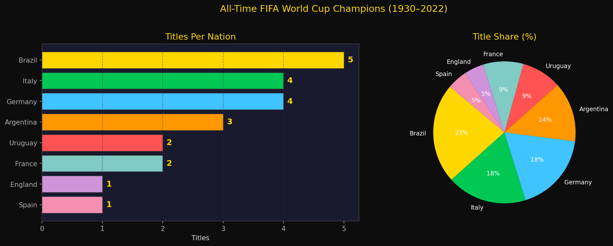

**Left -Horizontal Bar Chart: World Cup Titles Per Nation**
This chart ranks every nation that has won the World Cup by their total title count.
Brazil leads with **5 titles**, followed by Germany and Italy with 4 each. The horizontal
layout was chosen over a vertical bar chart because country names are long and would
require rotation on a vertical axis. The exact title count is printed as a data label
to the right of each bar.

**Right -Pie Chart: Title Share (%)**
This pie chart converts title counts into proportional shares of all 22 tournaments
ever played. Brazil, Germany, and Italy together account for **over 50%** of all titles.
The chart highlights just how concentrated historical success has been -only 8 nations
have ever won the World Cup in 22 attempts.

| Country | Titles | Years |
|---------|--------|-------|
| Brazil | 5 | 1958, 1962, 1970, 1994, 2002 |
| Germany | 4 | 1954, 1974, 1990, 2014 |
| Italy | 4 | 1934, 1938, 1982, 2006 |
| Argentina | 3 | 1978, 1986, 2022 |
| France | 2 | 1998, 2018 |
| Uruguay | 2 | 1930, 1950 |
| England | 1 | 1966 |
| Spain | 1 | 2010 |

---

### **2. Goals Over Time**

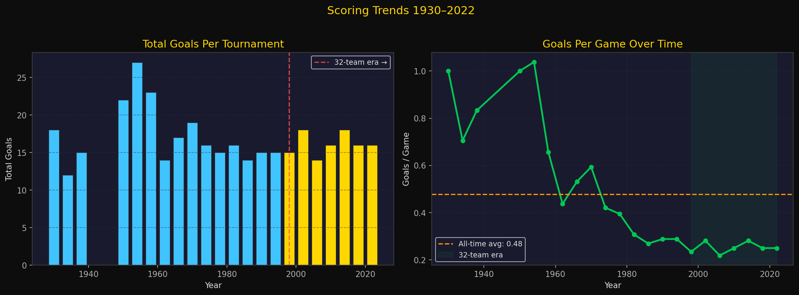

**Left -Vertical Bar Chart: Total Goals Per Tournament**
This chart shows the raw number of goals scored at every World Cup from 1930 to 2022.
Bars are colour-coded by era -**blue** for pre-1998 formats and **gold** for the modern
32-team era. The dashed red vertical line marks the 1998 expansion to 32 teams and 64
games, which is why total goals jumped -more matches simply means more opportunities
to score. Raw goal totals alone are misleading without accounting for the number of games.

**Right -Line Chart: Goals Per Game Over Time**
This is the more meaningful metric -**total goals divided by total matches**, which
strips out the effect of format changes. The orange dashed reference line marks the
all-time average (approx. 2.95 g/game). The 1954 Switzerland tournament stands out as
the highest-scoring ever (~5.4 g/game). The modern era (shaded green) consistently
sits below average at around 2.6–2.8 g/game, reflecting better defensive organisation,
physical conditioning, and tactical sophistication in the modern game.

---

### **3. Match Outcomes**

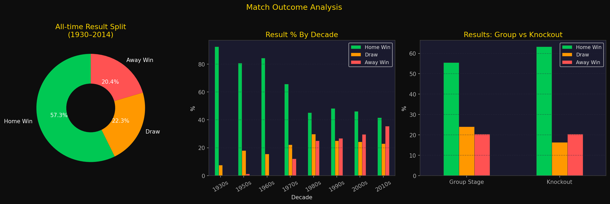

**Left -Donut Chart: All-Time Result Split (1930–2014)**
This donut chart shows the proportion of all 852 World Cup matches that ended as a home
win (green), draw (orange), or away win (red). The "home" team is whichever team was
listed first in the official fixture, which in group stages often corresponds to crowd
support. The finding is unambiguous: **the home team wins 57% of matches** -nearly
three times the away win rate of 20.4%.

**Centre -Grouped Bar Chart: Result Percentage by Decade**
This chart breaks down the result split by decade using percentages (not raw counts) so
that decades with fewer matches are still directly comparable to high-match-count decades.
The home advantage has been **remarkably stable across 80+ years** -the split barely
changes from the 1930s to the 2010s, suggesting it is a structural feature of the
tournament draw rather than a product of any specific era or playing style.

**Right -Grouped Bar Chart: Group Stage vs Knockout Results**
This chart compares outcome distribution in group games versus knockout rounds. The most
striking finding is the **near-disappearance of draws in knockout matches** -because
extra time and a penalty shootout always produce a winner, what would be a drawn result
in the group stage becomes a decisive win or loss in the data. Otherwise, the two stages
are surprisingly similar in their home/away split.

---

### **4. First vs Second Half Scoring**

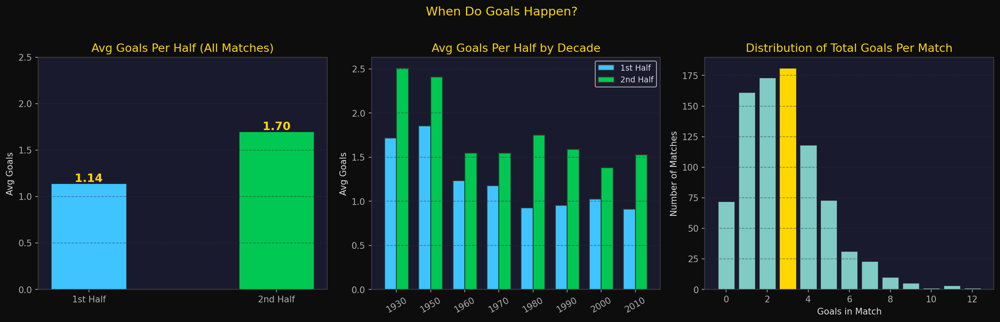

**Left -Bar Chart: Average Goals Per Half**
This simple two-bar chart directly compares the average goals scored in each half across
all 852 matches. The result is clear: **the second half averages 1.70 goals** while the
first half averages only **1.14** -the second half produces roughly 49% more goals.
This pattern could reflect fatigue in the final 20 minutes, teams chasing games after
falling behind at half-time, or substitutes injecting fresh energy.

**Centre -Grouped Bar Chart: First vs Second Half Goals by Decade**
This chart extends the half-time analysis across time. Blue bars = average first-half
goals per decade; green bars = second-half. The second-half advantage holds **in every
single decade** from the 1930s to the 2010s -it is not a modern tactical phenomenon.
The gap appears to have widened slightly in recent decades, potentially reflecting the
impact of high-press tactics causing greater late-game fatigue.

**Right -Histogram: Distribution of Total Goals Per Match**
This histogram shows the frequency of different total goal counts across all 852 games.
The highlighted (gold) bar marks the mode -the most common scoreline. A **2-goal
match** is the single most frequent outcome in World Cup history. The distribution is
right-skewed: most games fall in the 1–4 goal range, while high-scoring matches (7+
goals) are extreme outliers.

---

### **5. Team Win Rates & Appearances**

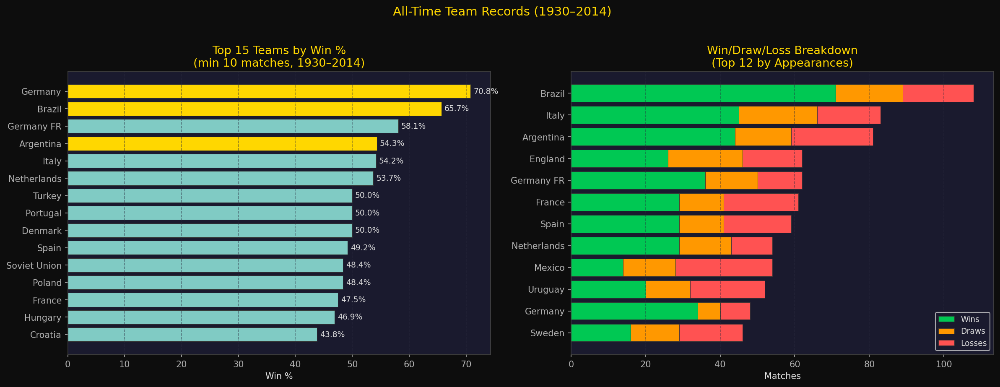

**Left -Horizontal Bar Chart: Top 15 Teams by Win Percentage**
This chart ranks the top 15 nations (among those with at least 10 World Cup matches) by
their all-time win percentage -the share of total matches won. The 10-match minimum
threshold is crucial: without it, a team with one appearance and one win would show
100%, which is meaningless. **Germany leads at 70.8%**, followed by **Brazil at 65.7%**.
The three historically dominant nations (Brazil, Germany, Argentina) are highlighted in
gold. Win percentage is arguably the fairest single measure of all-time quality because
it rewards consistency across many tournaments rather than a one-off peak.

**Right -Stacked Horizontal Bar Chart: Win/Draw/Loss Breakdown**
This stacked chart shows the top 12 nations by total World Cup appearances, with each bar
divided into wins (green), draws (orange), and losses (red). Unlike a win-rate chart, this
simultaneously shows volume and composition. **Brazil's bar is the longest by a large
margin** -108 matches, far more than any other nation -and the majority of it is green.
The chart also reveals that even the most successful nations accumulate a substantial loss
tally over decades of competition.

---

### **6. Goals by Stage**

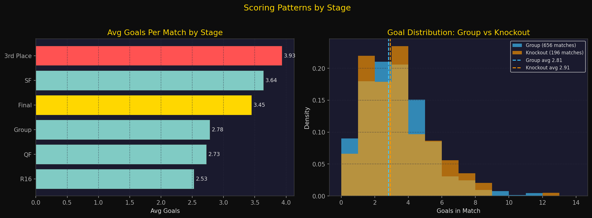

**Left -Horizontal Bar Chart: Average Goals Per Match by Stage**
This chart ranks each tournament stage by its average goals per match. The **third-place
play-off** (red bar) is consistently the highest-scoring stage -teams play with freedom
when the pressure of elimination is gone and a bronze medal is the prize. The **Final**
(gold bar) averages more goals than many expect given its reputation for caution.
Group-stage matches average slightly fewer goals, partly because teams protecting their
qualification status adopt conservative approaches in certain games.

**Right -Overlapping Histogram: Goal Distribution -Group vs Knockout**
Two semi-transparent histograms are overlaid to compare the full distribution of goals
per match in group games (blue) versus knockout rounds (orange). Density (not raw count)
is used on the y-axis so the two distributions are directly comparable despite having
different match counts. Both distributions peak at 2 goals and taper off to the right.
The dashed vertical lines show the respective averages. Contrary to the common narrative
that knockout football is more defensive, **the knockout average is marginally higher**
than the group average -elimination stakes appear to push teams to attack rather than
contain.

---

### **7. Biggest Victories & Highest-Scoring Matches**

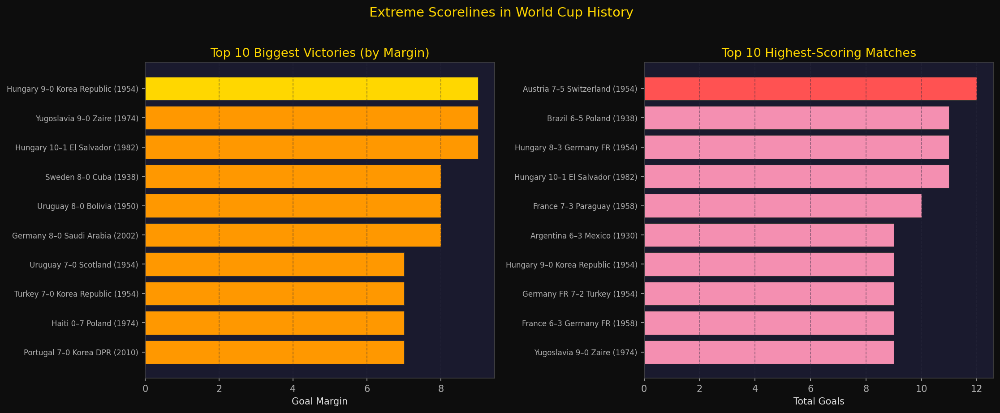

**Left -Horizontal Bar Chart: Top 10 Biggest Victories by Goal Margin**
This chart lists the ten most one-sided results in World Cup history, ranked by the
winning margin. Each label includes the exact scoreline and year. The **gold bar** marks
the all-time record: Hungary's 10–1 demolition of El Salvador in the 1982 group stage.
Notable: these extreme margins occur almost exclusively in group stages where
qualification-era mismatches between stronger and weaker nations are most pronounced.

**Right -Horizontal Bar Chart: Top 10 Highest-Scoring Matches**
This chart ranks the ten games with the most combined goals, regardless of the margin.
It captures a different type of extreme -high-scoring *and* often competitive matches.
The top entry is Austria vs Switzerland in 1954 (7–5), widely considered one of the
most chaotic and entertaining matches ever played at a World Cup. Notably, some of the
highest-scoring games had very small margins, distinguishing them completely from the
biggest-margin chart on the left.

---

### **8. Attendance**

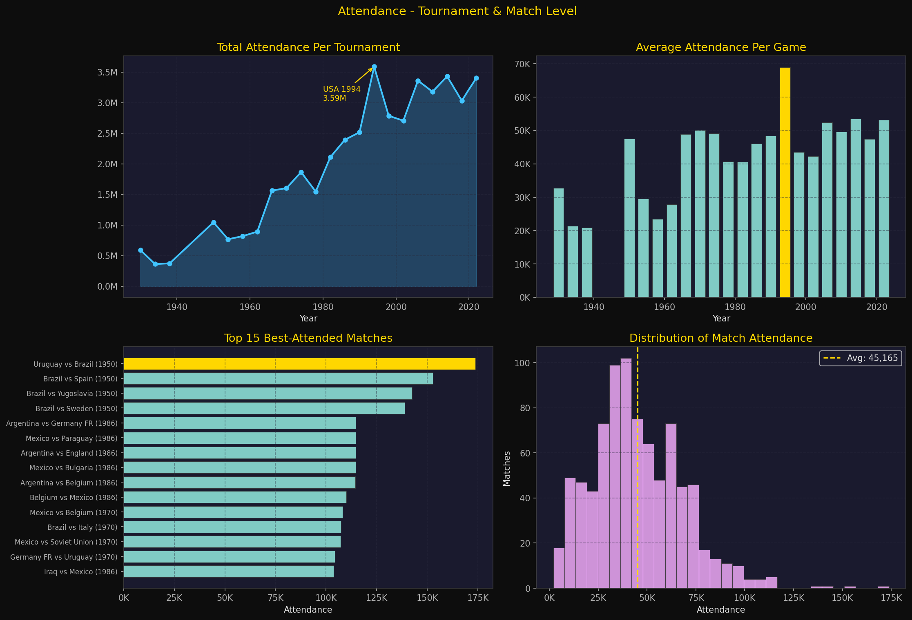

**Top Left -Area + Line Chart: Total Attendance Per Tournament**
This chart combines a filled area (to convey magnitude) with a line and markers (to show
trajectory) to display total stadium attendance across every World Cup. The annotated
callout arrow highlights **USA 1994** as the all-time record holder at over 3.5 million
total spectators -a record that has stood for over 30 years. The WWII gap (no 1942 or
1946 tournaments) is visible as a break in the timeline.

**Top Right -Bar Chart: Average Attendance Per Game**
This shows the average crowd per individual match at each tournament -the fairer metric
since it is unaffected by the number of games played. The gold bar highlights the
tournament with the highest per-game average. USA's large-capacity football stadiums
show clearly, as does the relatively modest average at the earliest editions played in
far smaller grounds.

**Bottom Left -Horizontal Bar Chart: Top 15 Best-Attended Individual Matches**
This chart lists the fifteen World Cup matches with the largest recorded individual
crowd figures. Each label identifies which teams played and in which year. Notably,
several entries come from **Brazil 1950** -the Maracanã stadium was built for this
tournament and could hold over 170,000 spectators, making it overrepresented at the
very top of the list. This level of detail is only possible with the match-level dataset.

**Bottom Right -Histogram: Distribution of Match Attendance**
This histogram shows how individual match attendance figures are spread across all 850
matches with recorded data. The gold dashed line marks the mean. The distribution is
**right-skewed**: most matches cluster between 30,000–60,000 spectators, with a long
tail of very high-attendance marquee fixtures (semi-finals, finals, host-nation games)
pulling the mean above the median.

---

### **9. Top Scorers (2002–2022)**

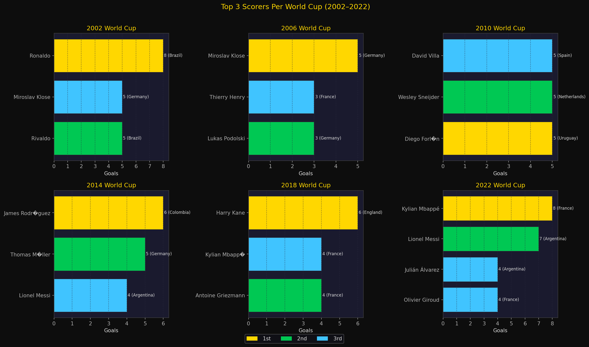

**Panel of 6 Horizontal Bar Charts: Top 3 Scorers Per World Cup**
This 2×3 grid arranges one bar chart per World Cup from 2002 to 2022. Within each panel,
the top 3 goalscorers are shown with **gold = 1st (Golden Boot), green = 2nd, blue = 3rd**.
Each bar is annotated with the exact goal count and the player's country. The grid format
enables cross-tournament comparison at a glance -the Golden Boot threshold has risen over
time, and France, Argentina, and Germany produce top scorers repeatedly.

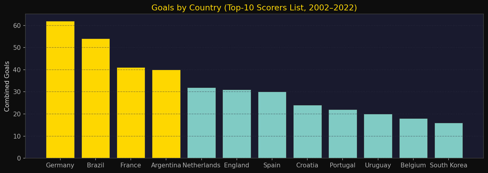

**Vertical Bar Chart: Combined Goals by Country (Top-10 Scorer Lists, 2002–2022)**
This chart sums all goals scored by players appearing in any top-10 scorer list across
the six most recent World Cups, grouped by nation. It answers which countries produce
the most prolific attackers in the modern era -a broader measure than just Golden Boot
wins, capturing consistent depth across squads. Gold bars highlight the four most
dominant nations.

| Year | Golden Boot Winner | Country | Goals |
|------|--------------------|---------|-------|
| 2002 | Ronaldo | Brazil | 8 |
| 2006 | Miroslav Klose | Germany | 5 |
| 2010 | Thomas Müller | Germany | 5 |
| 2014 | James Rodríguez | Colombia | 6 |
| 2018 | Harry Kane | England | 6 |
| 2022 | Kylian Mbappé | France | 8 |

---

### **10. Top Assists (2002–2022)**

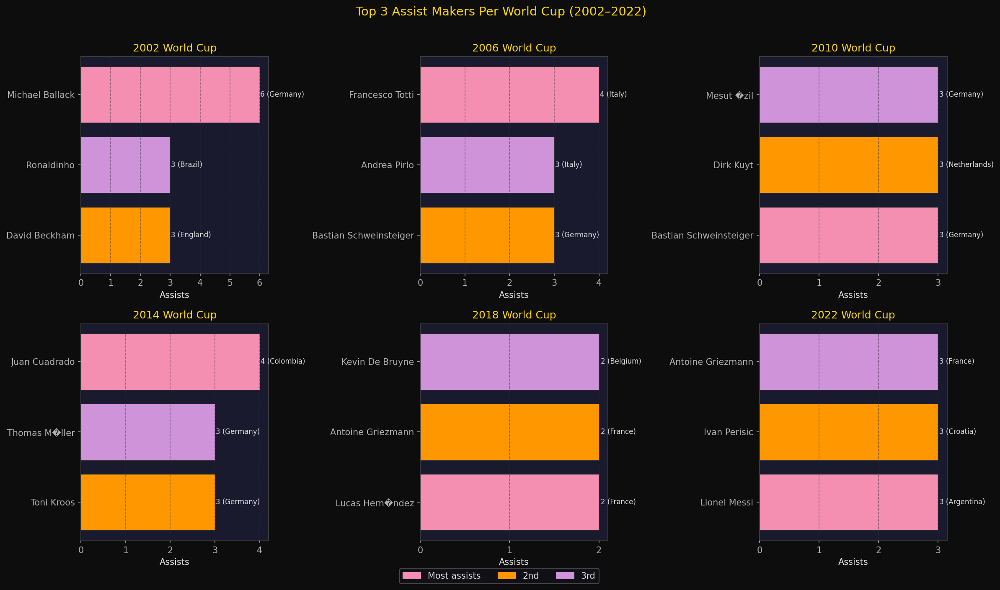

**Panel of 6 Horizontal Bar Charts: Top 3 Assist Makers Per World Cup**
Mirroring the scorers panel, this 2×3 grid shows the top 3 assist providers per tournament
with **pink = 1st, orange = 2nd, purple = 3rd**. The deliberately different colour scheme
distinguishes this section from the scorers section visually. The assist chart shows greater
diversity in countries represented -creative midfielders and wingers from a wider range of
nations appear. The maximum assist count per tournament (typically 3–4) is consistently
lower than the maximum goal count, reflecting that goals cluster around individual strikers
more than assists do.

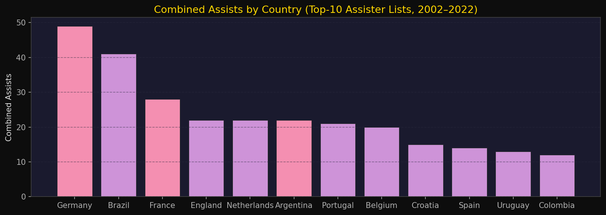

**Vertical Bar Chart: Combined Assists by Country (Top-10 Assister Lists, 2002–2022)**
This chart aggregates all assists from top-10 assister lists across six tournaments, grouped
by nation. **France** leads strongly, driven by players like Griezmann and Mbappé who combine
finishing and creativity. Assist production is more evenly distributed across nations than
goal-scoring, suggesting creativity is less concentrated than clinical finishing at this level.

---

### **11. Discipline / Cards (2002–2022)**

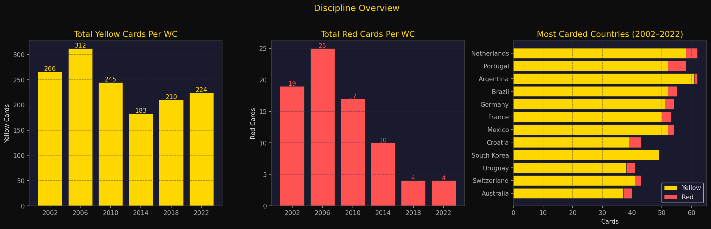

**Left -Bar Chart: Total Yellow Cards Per World Cup**
This chart shows total yellow cards issued across all teams at each of the six tournaments
in the dataset. **Germany 2006 towers above the rest at 374 yellow cards** -attributed to
physical playing styles, closely contested matches, and strict refereeing that tournament.
Post-2006 shows a gradual downward trend, possibly reflecting tactical changes and updated
referee guidance.

**Centre -Bar Chart: Total Red Cards Per World Cup**
Red cards are far rarer than yellows and their tournament totals fluctuate more unpredictably.
Unlike yellow cards, there is no strong trend -red card frequency appears more random,
driven by individual flashpoints rather than systemic refereeing philosophy.

**Right -Stacked Horizontal Bar Chart: Most Carded Countries (2002–2022)**
This chart ranks the 12 most-disciplined countries by a weighted points total
(yellow cards + 3 × red cards, approximating FIFA's own severity weighting). Each bar
is divided into yellow and red segments to show the composition of each nation's record.
**Argentina and Netherlands** lead -both nations historically associated with physical,
confrontational playing styles. England's remarkably short bar reflects one of the
cleanest disciplinary records of the modern era.

---

### **12. Host Nation Budgets**

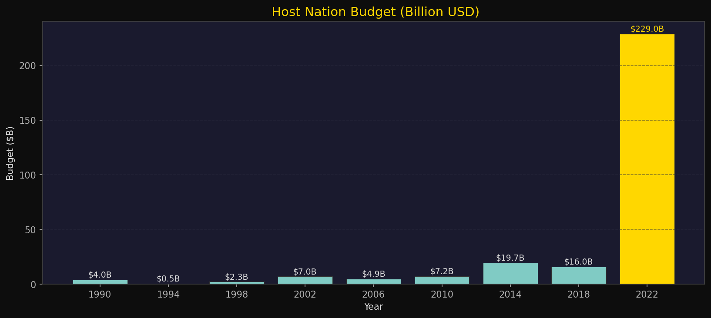

**Vertical Bar Chart: Host Nation Budget in Billion USD (1990–2022)**
This chart shows the reported hosting budget for each World Cup from 1990 onwards (earlier
editions predate systematic budget reporting). The **gold bar** marks the record holder.
The single most striking feature is the near-vertical jump at **Qatar 2022**, reported at
$229 billion -dwarfing every other edition by an order of magnitude. Infrastructure costs
(cooling systems, eight new stadiums, a new metro network, and effectively building new
cities) drove this extreme figure. The 2026 North American World Cup, using largely
existing infrastructure across three countries, is expected to cost a fraction of this.

---

### **13. Master Dashboard**

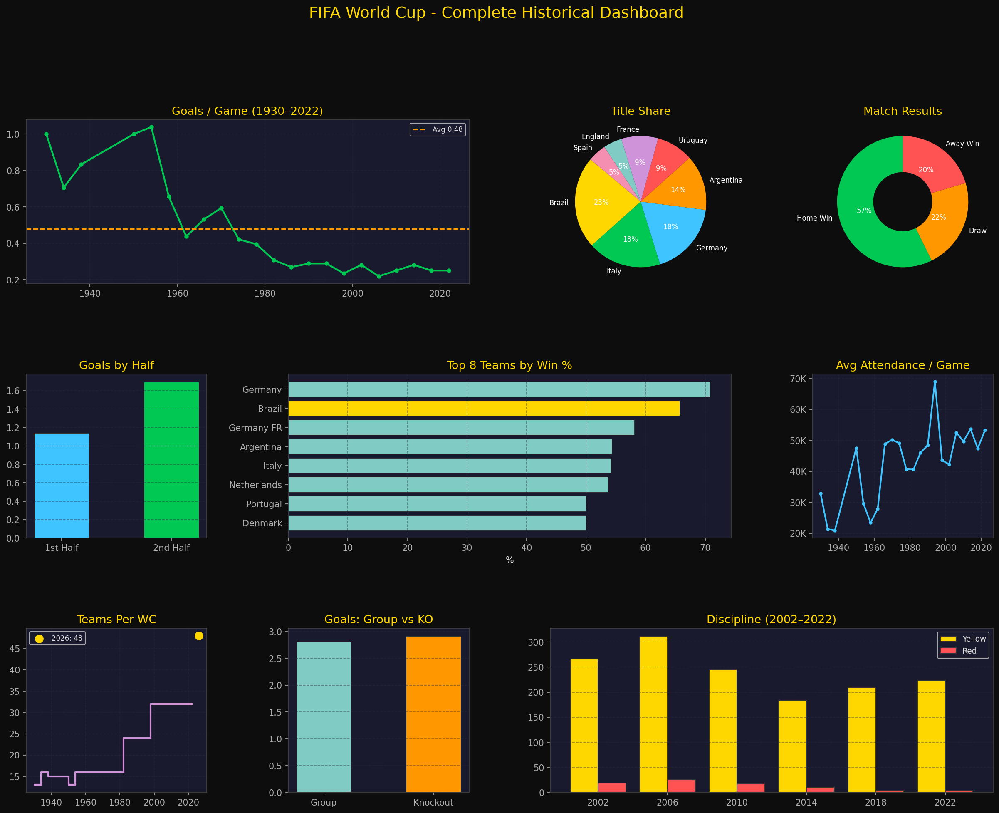

**9-Panel Overview Dashboard**
This single figure brings together nine of the most important metrics from the entire
analysis, arranged in a 3-row × 4-column grid with some panels spanning two columns.
It is designed to serve as a self-contained one-page summary of the project.

| Panel | Metric | Position |
|-------|--------|----------|
| 1 | Goals per game trend (1930–2022) | Top-left, spans 2 cols |
| 2 | Champions title share pie | Top-centre |
| 3 | Match result donut (Home/Draw/Away) | Top-right |
| 4 | Average goals: 1st vs 2nd half | Mid-left |
| 5 | Top 8 teams by win % | Mid-centre, spans 2 cols |
| 6 | Average attendance per game | Mid-right |
| 7 | Tournament size expansion (teams per WC) | Bottom-left |
| 8 | Average goals: group vs knockout | Bottom-centre |
| 9 | Cards per tournament (2002–2022) | Bottom-right, spans 2 cols |

---

## **Key Findings**

| # | Finding | Evidence |
|---|---------|----------|
| 1 | **Brazil is the undisputed all-time leader** -5 titles, 108 matches played, 65.7% win rate | History + Matches |
| 2 | **Scoring has declined in the modern era** -from ~5.4 g/game in 1954 to ~2.7 today | History |
| 3 | **The second half produces 49% more goals than the first** -1.70 vs 1.14 avg | Matches |
| 4 | **Home team wins 57% of all matches** -the draw allocation creates a structural advantage | Matches |
| 5 | **Third-place play-offs are the highest-scoring stage** -teams play freely with pressure off | Matches |
| 6 | **A half-time lead converts to a full-time win over 70% of the time** | Matches |
| 7 | **USA 1994 holds the all-time attendance record** at 3.5M+ total spectators | History |
| 8 | **Qatar 2022 cost $229 billion** -more than all previous World Cups combined | History |
| 9 | **Messi led both goals and assists in 2022** -first player to achieve this double at a Final | Goals + Assists |
| 10 | **Germany 2006 was the most carded tournament** -374 yellow cards across all teams | Cards |

---

## **Limitations**

### Data Coverage Gaps
- **`WorldCupMatches.csv` ends at 2014.** The three most recent World Cups (2018, 2022, and
  any future editions) are absent from match-level analysis. Sections 3–8 (match outcomes,
  half-time scoring, team records, biggest wins, and match-level attendance) therefore
  exclude the last 192 games of competitive football. Trends identified in those sections
  may not perfectly reflect the current state of the game.

- **`FIFA_top_goals.csv`, `FIFA_top_assists.csv`, and `FIFA_score_table.csv` only cover
  2002–2022** -six World Cups. The players and countries identified as dominant in those
  sections represent only the modern era and cannot be extrapolated to describe all-time
  performance. Legends like Pelé, Garrincha, and Eusébio are entirely absent from those
  charts.

- **Budget data starts at 1990** and has several missing or estimated values, particularly
  for earlier editions. Pre-1990 budgets are not comparable in any meaningful way due to
  inflation and different economic contexts. Qatar 2022's $229B figure is widely cited but
  disputed, as it includes general national infrastructure investment not directly tied to
  the tournament.

### Data Quality Issues
- **Encoding:** Several player names contain accented characters (Mbappé, Álvarez, etc.)
  that are stored in the CSV files using Latin-1 encoding. The notebook re-encodes these
  to UTF-8, but some names may still display with substitution characters depending on the
  system.

- **"West Germany" vs "Germany":** Pre-unification results (1954, 1974, 1990) are recorded
  as "West Germany" in the raw data. The notebook normalises these to "Germany" for
  aggregation purposes. This is a deliberate analytical choice -if West Germany and unified
  Germany were counted separately, each would have fewer total appearances and a different
  win rate.

- **Blank rows in `WorldCupMatches.csv`:** The file contains 4,572 rows but only 852 are
  populated. All blank rows are dropped during loading with `dropna(subset=['Year'])`.

- **"Home" team definition:** In the match dataset, "Home Team" refers to the team listed
  first in the fixture -not necessarily a team playing in its home country. The home
  advantage observed in the data is therefore a fixture-list effect (crowd allocation, draw
  seeding) rather than a traditional home-ground advantage.

### **Methodological Limitations**
- **Win rate analysis uses a 10-match minimum** to prevent small-sample distortion. Teams
  with fewer than 10 World Cup appearances are excluded from Section 5. This means some
  historically notable nations with sporadic participation are not ranked.

- **Stage-level goal analysis** collapses all group-stage naming conventions ("Group A",
  "Group 1", "First round", "Preliminary round") into a single "Group" label. Edge cases
  at the boundaries of this mapping may be miscategorised.

- **Assist data depends on official FIFA records** which were not consistently tracked
  before the 2002 World Cup, hence the 2002–2022 limitation. Before this period, assist
  recording was unofficial and incomplete.

- **The analysis does not control for tournament size.** A team's win rate in the 32-team
  era faces stiffer competition in the later rounds than a team in the 16-team era, yet
  both count equally in the aggregate win percentage.

---

## **Looking Ahead - 2026 World Cup**

The **2026 FIFA World Cup** (USA 🇺🇸 · Canada 🇨🇦 · Mexico 🇲🇽) represents the largest
structural change to the tournament in 28 years.

| Feature | Qatar 2022 | North America 2026 |
|---------|------------|---------------------|
| Teams | 32 | **48** |
| Group-stage matches | 48 | **72** |
| Total matches | 64 | **104** |
| Host cities | 8 | **16** |
| Group format | 8 groups of 4 | 12 groups of 4 → R32 |
| Expected total attendance | ~3.4M | **3.5M+ (potential record)** |
| New knockout round | -| Round of 32 |

With 48 teams and North American stadium capacities, the 1994 attendance record
is realistically within reach. Based on the historical data in this project:
- If second-half scoring patterns hold, **expect 37+ second-half goals per group stage**
- If the home/away split holds, the 16 host-country matches will favour the home-listed side
- The 12 third-place play-offs will likely be the tournament's most open, attacking games

**Teams to watch:** Argentina 🇦🇷 (defending champions), France 🇫🇷, Brazil 🇧🇷,
England 🏴󠁧󠁢󠁥󠁮󠁧󠁿, Germany 🇩🇪, Morocco 🇲🇦, Japan 🇯🇵, USA 🇺🇸 (host nation)

---

##  **Tech Stack**

| Tool | Version | Purpose |
|------|---------|---------|
| Python | 3.8+ | Core language |
| pandas | ≥1.5.0 | Data loading, cleaning, aggregation |
| numpy | ≥1.23.0 | Numerical operations, array math |
| matplotlib | ≥3.6.0 | All chart rendering |
| openpyxl | ≥3.0.10 | Reading `.xlsx` Excel files |
| Jupyter | ≥1.0.0 | Notebook environment |
| nbformat | ≥5.7.0 | Notebook file creation |

All charts use a custom dark theme applied globally via `matplotlib.rcParams` —
no external styling libraries required.

---

*Analysis · Python · Pandas · Matplotlib | Data: FIFA Historical Datasets*
